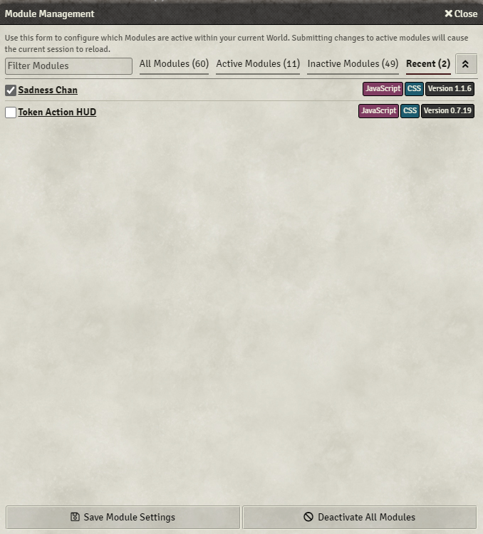

# Quick Module Enable
Easily enable new modules, see which ones might need manual re-install to update, and distinguish between minor and major incompatibilites (based on version number)

This module allows you to enable newly installed modules with a single click. Upon loading a world, if there are any new modules since the last load,it will display the Module Manager with a filter showing just the new modules, which have been pre-checked for enabling. You will simply need to click the 'Save' button at the bottom. You can uncheck any modules you don't want installed, or simply click 'X' to make no changes.

In addition, it provides a adds several filters to the stock Module Manager:
* Recent - Shows which shows modules that have been recently installed, or you have updated recently.
* Major Mismatch - Modules that the listed major version is differing (e.g. 0.6.x vs 0.7.x)
* Minor Mismatch - Moudles that the listed minor version is differing (e.g. 0.7.7 vs 0.7.6) 
* Manual Reinstall Needed - Modules that likely cannot be updated without uninstalling and reinstalling.  This is often because of authors putting the wrong manifest link in their module, but can also be due to modules changing owners. This pulls data upon opening the module manager, and only refreshes a max of 1/day to avoid wasted calls. More details of the exact manifests involved are listed in the console if needed. This tab will not be visible on The Forge, since the bazaar does this checking automatically.

# Questions
Feel free to contact me on Discord @ChrisF#4895, by filing an issue on GitLab, or using the [Bug Reporter Module](https://foundryvtt.com/packages/bug-reporter/).